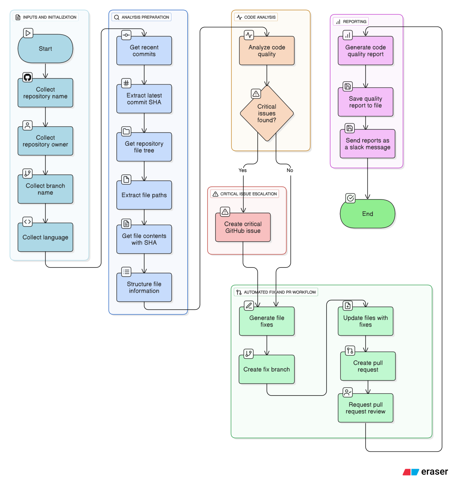
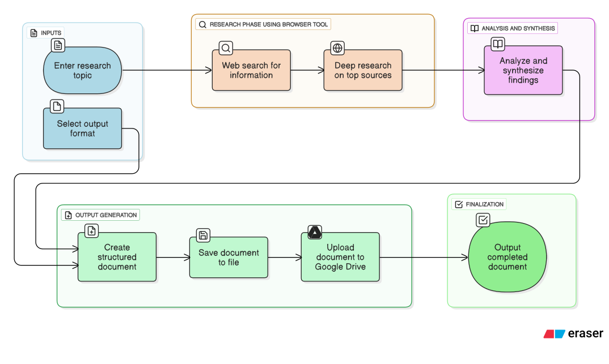
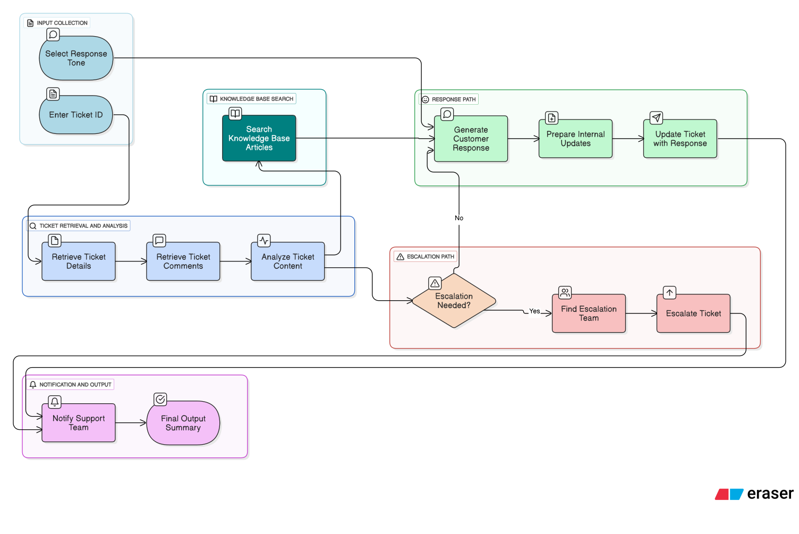
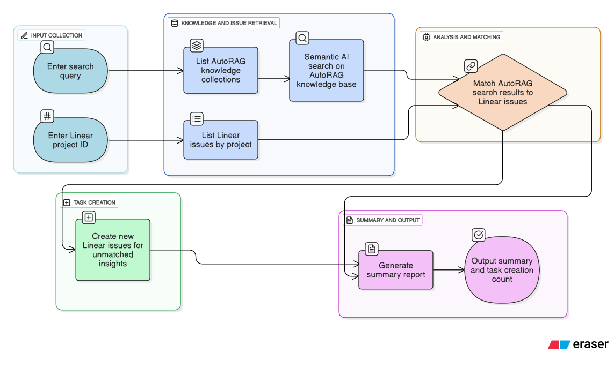

# portia-wemakedevs-hackathon-project-by-adityaJha

# PortiaAI Implementation Analysis: Comprehensive Feature Documentation

This document provides a technical analysis of four distinct PortiaAI workflow implementations, highlighting the framework's capabilities and their practical applications in software development environments.

---
---
---
## Plan A: Automated Code Quality Analysis and Maintenance ##
This plan focuses on simplifying the process of identifying and resolving vulnerabilities and inconsistencies in code. By combining Portia’s intelligent planning system with GitHub MCP tools, it automatically analyzes the latest file changes, detects potential issues, and creates corresponding tickets. It then generates fixes in a separate branch and raises pull requests for review, enabling developers to address problems more efficiently. This end-to-end automation reduces manual effort, accelerates remediation, and ultimately enhances both code quality and developer productivity.

---

### Technical Components
- **Repository Integrity Analysis**: End-to-end repository inspection with full commit history traversal, SHA fingerprinting, and branch consistency validation.  
- **Static Code Quality Assessment**: Abstract Syntax Tree (AST)–similar genAI analysis incorporating cyclomatic complexity scoring, dead code identification, unused dependency detection, and maintainability index computation.  
- **Automated Remediation Pipeline**: Deterministic, file-level patch generation and content rewriting with SHA preservation, change-set tracking, and regression safety checks.  
- **Pull Request Orchestration**: Seamless CI/CD integration with automated fix branch creation, PR instantiation, and assignment of structured review requests.  
- **Intelligent Issue Management**: Rule-based and threshold-driven issue generation for critical findings, auto-classification of problem severity, and linking back to specific code locations and commit history.  

---

### Mapping to PlanBuilderV2 Workflow
- **Step 1–3 (commit + tree scan)** → Repository Integrity Analysis  
- **Step 4–7 (analysis via AST/code smells)** → Static Code Quality Assessment  
- **Step 9–11 (file fix + branch)** → Automated Remediation Pipeline  
- **Step 12–13 (PR + review)** → Pull Request Orchestration  
- **Step 14 (issue creation)** → Intelligent Issue Management  

---
### Architecture Diagram

---

### Advanced Workflow Control
- **Dynamic Conditional Logic**: Fine-grained branching with `if_/else_/endif_` constructs, enabling execution paths driven by real-time code quality metrics and policy thresholds.  
- **Deep GitHub API Orchestration**: Full-spectrum repository lifecycle management (commits, branches, pull requests, and reviews) executed via MCP (Model Context Protocol) tools for scalable automation.  
- **Rich Data Modeling Layer**: Hierarchical Pydantic schemas designed for commit lineage tracking, file-level state management, vulnerability mapping, and multi-dimensional quality analysis.  
- **Self-Healing Remediation Loop**: Autonomous detection–fix–validate cycle including deterministic patch creation, isolated branch provisioning, regression-safe PR generation, and reviewer orchestration. 

---

### PortiaAI Features Utilized
- Advanced conditional workflow logic
- MCP server integration for GitHub operations
- Complex Pydantic schema validation
- Critical threshold-based decision making
- Comprehensive reporting and file operations

---

### Developer Productivity Benefits
This implementation transforms code maintenance from a reactive to a proactive process. Developers benefit from automated code quality monitoring that continuously scans repositories, identifies technical debt, and generates actionable fixes. The workflow eliminates the manual effort required for code reviews, quality assessments, and maintenance task creation. *By automatically creating branches, applying fixes, and generating pull requests, it streamlines the entire code improvement lifecycle.* This is especially valuable for development teams managing multiple repositories, enabling consistent code quality standards and reducing the technical debt accumulation that typically occurs in fast-paced development environments.

---
---
---

## Plan B: Intelligent Research & Documentation Automation ##
From a developer’s perspective, research and documentation are often time-consuming yet critical tasks. This plan leverages Portia’s intelligent planning system to streamline how developers gather, structure, and present information on a given topic. Instead of manually sifting through multiple sources, the system automates the collection of relevant material, validates it against trusted references, and organizes it into clear, developer-friendly documentation using some intelligent inbuilt tools like *browser tool*. For engineers, this means less time spent switching contexts and more time focused on problem-solving and building features.

---

### Technical Components
- **Custom Tooling & Integration**: Combines `search_tool` for broad discovery with `browser_tool` for deep-dive extraction, orchestrated via `PortiaToolRegistry`.  
- **Structured Data Modeling**: `ResearchResult` for synthesized findings and `DocumentContent` for rich document abstraction, both enforced with Pydantic type safety.  
- **Data Persistence & Export**: Automated Markdown generation with optional extension to external storage systems (e.g., Google Drive).  
- **Configurable Environment**: Flexible model management (`google/gemini-2.0-flash`) with `.env`-based API key injection.
- **Web Search Integration**: Automated information gathering using `search_tool`
- **Browser Automation**: Deep-dive research capability with `browser_tool` for extracting detailed information from sources
- **LLM-Powered Analysis**: Synthetic analysis of research data with structured output schemas
- **File System Operations**: Automated document creation and storage with `file_writer_tool`
- **Cloud Storage Integration**: Google Drive upload functionality (configurable)  

---

### Advanced Workflow Control
- **Multi-Step Research Pipeline**: Chained steps for search, targeted crawl, synthesis, and structured documentation.  
- **Conditional Composition**: Extensible logic for skipping, branching, or escalating when coverage is insufficient.  
- **LLM-Driven Synthesis**: Uses natural language analysis to unify multiple sources into domain-specific insights.   

---

### Architecture Diagram

---

### PortiaAI Features Utilized
- Custom tool creation and registration
- ToolRegistry for tool management
- CLIExecutionHooks for execution monitoring
- Complex conditional workflow logic
- Function step integration
- Single-tool agent steps
- Multi-registry tool composition
- Slack cloud tool integration

---

### Developer Productivity Benefits
This workflow revolutionizes customer support operations by automating the entire ticket processing pipeline. Developers building support systems can leverage this pattern to create intelligent routing, automated response generation, and escalation management without building complex decision trees manually. The custom tool approach enables rapid integration with any ticketing system, while the conditional logic ensures appropriate handling of different ticket types. Support teams benefit from reduced response times, consistent communication quality, and intelligent escalation, while developers gain a framework for building sophisticated support automation that adapts to business rules and customer needs.

---
---
---

## Plan C: Intelligent Customer Support Automation
This plan is designed to ease the burden on developers who often get pulled into repetitive support queries. By automating customer support through Portia’s workflow and integration with knowledge bases, the system can handle common issues, triage tickets, and surface only the complex cases that require developer insight. This reduces interruption, minimizes context switching, and ensures that developers can stay focused on core engineering work while customers still receive timely, accurate support.

*This tool had to be originally used with Zendesk MCP tools, but due to some errors we were not able to access its server, as a result we created our own custom tools (using Portia's Tool Registry) exactly mimicing the Zendesk tools, only a simple name change is required at all the tool names in order to incorporate the actual MCP tools when necessary
i.e->'portia:zendesk:tickets:show' tool has been custom made as 'zendeskticketsshow'*

---

### Technical Components ###
- **Tool Decorator Implementation**: Eight custom Zendesk tools using `@tool` decorator with type annotations
- **ToolRegistry Management**: Custom tool registration and integration with existing tool ecosystems
- **Multi-Channel Notifications**: **Slack integration** for team coordination
- **Mock Data Implementation**: Comprehensive test data structures for development and testing
- **API Abstraction**: Clean interface layer for external service integration
- **Sentiment Analysis Integration**: AI-powered customer sentiment evaluation
- **Escalation Logic**: Automated decision-making for ticket routing and prioritization
- **Knowledge Base Integration**: Contextual article retrieval for automated response generation

---

### Workflow Orchestration ###
- **Conditional Branching**: Dynamic workflow paths based on ticket analysis results
- **Function Step Integration**: Custom function execution within workflow context
- **Multi-Tool Coordination**: Seamless integration between custom and cloud-based tools
- **Response Generation**: Context-aware customer communication with configurable tone

---
### Architecture Diagram ###

---

### PortiaAI Features Utilized
- Custom tool creation and registration
- ToolRegistry for tool management
- CLIExecutionHooks for execution monitoring
- Complex conditional workflow logic
- Function step integration
- Single-tool agent steps
- Multi-registry tool composition
- Slack cloud tool integration

---

### Developer Productivity Benefits
This workflow revolutionizes customer support operations by automating the entire ticket processing pipeline. Developers building support systems can leverage this pattern to create intelligent routing, automated response generation, and escalation management without building complex decision trees manually. The custom tool approach enables rapid integration with any ticketing system, while the conditional logic ensures appropriate handling of different ticket types. Support teams benefit from reduced response times, consistent communication quality, and intelligent escalation, while developers gain a framework for building sophisticated support automation that adapts to business rules and customer needs.

## Plan D: Knowledge Management and RAG over Company Documents ##

Developers and teams often struggle with scattered documentation spread across wikis, confluence, shared drives, and code repositories. This plan introduces a centralized knowledge management workflow powered by Retrieval-Augmented Generation (RAG). By indexing company documents, policies, design specs, and past decisions, the system enables developers to query information in natural language and instantly retrieve contextually relevant answers. Instead of digging through multiple sources, engineers can quickly surface the right code example, API guideline, or architectural decision, reducing wasted time and avoiding inconsistencies. Over time, this approach transforms organizational knowledge into an accessible, AI-powered assistant that evolves as projects grow.

---

### Technical Components ###
- **AutoRAG Integration**: Advanced retrieval-augmented generation using Cloudflare's AutoRAG service
- **Linear API Integration**: Comprehensive issue management through Linear's MCP server
- **Vector Search Capabilities**: AI-powered semantic search across knowledge repositories
- **Intelligent Task Creation**: Automated issue generation based on knowledge gaps
- **Cross-Platform Data Correlation**: Intelligent matching between knowledge base content and project management issues
- **Multi-Source Analysis**: Correlation of search results with existing project issues
- **Integrated Reporting**: Comprehensive summaries linking knowledge insights to actionable tasks

---

### Architecture Diagram ###

---

### PortiaAI Features Utilized
- MCP server integration for both AutoRAG and Linear services
- Advanced semantic search capabilities
- Multi-step workflow orchestration
- LLM-powered data correlation and analysis
- Automated task creation workflows
- Structured output with complex data relationships
- Cross-platform service integration

---

### Developer Productivity Benefits
This workflow addresses the critical challenge of knowledge management in development teams by automatically connecting institutional knowledge with active project work. Developers benefit from automated discovery of relevant documentation, identification of knowledge gaps in current projects, and intelligent task creation that ensures important insights are converted into actionable work items. The semantic search capabilities eliminate manual knowledge base searches, while the Linear integration ensures that valuable insights are captured in the project management workflow. This is particularly valuable for teams managing complex products where documentation, tribal knowledge, and active development work need to remain synchronized and actionable.

---

## Comprehensive PortiaAI Framework Analysis

### Universal Framework Features Demonstrated

**Workflow Orchestration Capabilities**
- **PlanBuilderV2**: Declarative workflow construction with sequential, conditional, and parallel execution patterns
- **Step Chaining**: Seamless data flow between workflow components using StepOutput references
- **Input Parameterization**: Dynamic workflow configuration with default values and type validation
- **Conditional Logic**: Sophisticated branching logic with lambda-based condition evaluation

**Integration Architecture**
- **Tool Registry System**: Flexible tool management supporting custom, open-source, and cloud-based tools
- **MCP Server Support**: Native integration with Model Context Protocol servers for external service connectivity
- **Multi-Modal Tool Coordination**: Seamless orchestration of API calls, file operations, and AI processing
- **Authentication Management**: Centralized credential handling for cloud services and external APIs

**AI and Language Model Integration**
- **LLM Step Processing**: Structured AI task execution with schema-validated outputs
- **Single-Tool Agent Steps**: AI-powered tool usage with natural language task descriptions
- **Output Schema Validation**: Pydantic-based type safety for AI-generated content
- **Model Configuration**: Flexible LLM provider selection and configuration management

**Development Experience Enhancements**
- **Type Safety**: Comprehensive type annotation support with runtime validation
- **Error Handling**: Built-in retry logic and graceful failure management
- **Execution Monitoring**: Complete workflow observability with step-by-step tracking
- **User Attribution**: Multi-tenant support with end-user tracking and audit capabilities

### Framework Value Proposition for Developers

**Development Velocity**
PortiaAI eliminates the complexity traditionally associated with AI workflow development by providing a declarative approach to building sophisticated automation systems. Developers can focus on business logic rather than infrastructure concerns, reducing development time from weeks to days for complex multi-step workflows.

**Maintainability and Scalability**
The framework's declarative nature creates self-documenting workflows that are easily understood, modified, and extended. The structured approach to tool integration and data flow management ensures that workflows remain maintainable as they grow in complexity.

**Production Readiness**
Built-in features for monitoring, error handling, user attribution, and authentication management mean that workflows developed with PortiaAI are production-ready by default, eliminating the need for extensive infrastructure development.

**Integration Simplicity**
The universal tool registry approach and MCP server support enable rapid integration with existing systems and services, reducing the typical integration overhead associated with building AI-powered automation systems.

This comprehensive framework analysis demonstrates PortiaAI's capability to transform complex automation requirements into manageable, maintainable, and scalable workflow implementations across diverse use cases in modern software development environments.
